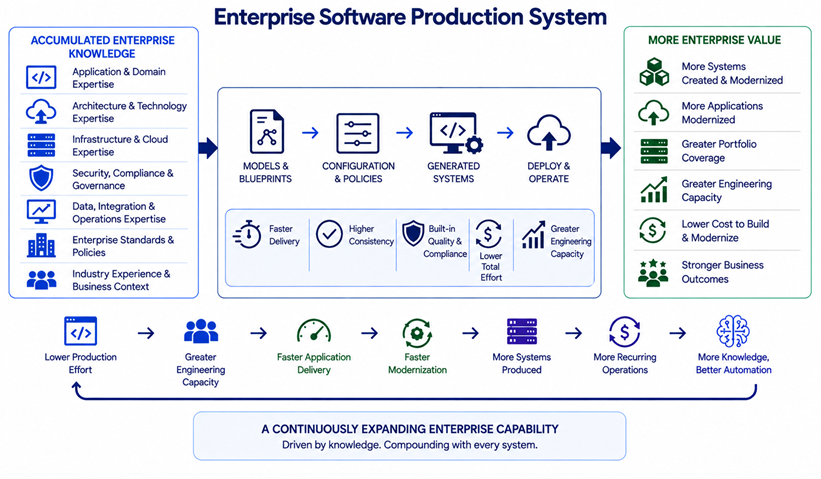

# Why

To increase the capacity, consistency and economics of software production and modernization of large enterprises that manage substantial application portfolios 

The premise is simple: much of the knowledge required to create, modernize, deploy and operate enterprise systems is repeatedly recreated across applications, projects and teams. Architecture decisions, technology standards, security requirements, infrastructure patterns, integration approaches and industry knowledge often remain distributed across people, documents and existing systems.

Captures that knowledge as reusable, executable production capability.

Enterprise architects, application architects, infrastructure architects and domain SMEs encode application, architecture, infrastructure, cloud, security, governance and industry expertise in blueprints and models. Harbormaster uses that knowledge to produce complete systems and establish repeatable production patterns.

The objective is not to replace the enterprise's engineering organization or turn every developer into a model author.

**The objective is to give the CIO, Chief Architect, Enterprise Architect and Application Portfolio Owner a mechanism for turning accumulated enterprise knowledge into an organizational software-production capability.**

The resulting opportunity extends across the application portfolio:

> **Lower production effort → greater engineering capacity → faster application delivery → faster modernization → more systems produced.**



---

## The Enterprise Moat

> **The moat isn't any single capability. It is the reinforcing system created when production power, proprietary production IP, compounding production advantage, and AI production intelligence continuously strengthen one another.**
>
> Explore the moat to understand its hypotheses with evidence to serve as proof to its value as a transformational competitive edge.
> 
> [Explore thr Enterprise Moat](./moat.md)

---

## The Transformation Creates Four Transcendent Benefits

The four layers are not sequential benefits where one is inherently more valuable than another. They represent four reinforcing ways the transformation can create strategic advantage for a large enterprise.

---

## 1. Production Power

### Turn Enterprise Knowledge Into Systems

*The Engine That Increases Enterprise Software-Production Capacity*

Application, architecture, infrastructure, security and technology knowledge becomes executable through blueprints, models, configurations and system generation.

Allow defined classes of systems and system capabilities to be created and modernized with progressively less production effort.

For the enterprise, this creates the first opportunity:

> **Lower production effort → greater engineering capacity.**

The organization can use that capacity to create new applications, modernize existing applications, address technical debt and respond more quickly to changing business requirements.

The objective is not simply to make an individual project cheaper.

**It is to increase the amount of software the enterprise can produce and modernize with its existing organizational capacity.**

---

## 2. Application Portfolio Advantage

### Turn Production Capability Into Portfolio Capacity

*More Capacity. Faster Modernization. Greater Portfolio Value.*

Large enterprises often manage hundreds or thousands of applications across multiple generations of technology, architectures and infrastructure environments.

Provide a mechanism for applying reusable production knowledge across that portfolio.

Rather than approaching every application or modernization initiative as an independent engineering exercise, recurring patterns can become reusable production capability:

- Standard application architectures.
- Approved technology stacks.
- Enterprise integration patterns.
- Security and governance requirements.
- Infrastructure configurations.
- Cloud and hybrid-cloud deployment patterns.
- Data and persistence patterns.
- API and service patterns.
- Industry and business-domain models.
- CI/CD and operational requirements.

This creates a direct connection between production capability and application-portfolio strategy:

> **More reusable production knowledge → more applications can be modernized with the same organizational capacity.**

For the CIO and application portfolio owner, this can change the economics of modernization.

Applications that previously competed for scarce engineering resources can become more economically viable to modernize, replace or extend.

**Increase not only production efficiency, but the enterprise's ability to act on its application portfolio.**

---

## 3. Compounding Enterprise Advantage

### Make Every System Make the Next One Easier

*Every System Adds to the Enterprise Production Knowledge Base*

Enterprise systems do not simply consume engineering resources.

The architecture, technology choices, configurations, implementation patterns and lessons associated with those systems can become reusable organizational knowledge.

Provide a mechanism for turning that knowledge into increasingly reusable production capability.

Blueprints can capture:

- Application architectures.
- Technology standards.
- Infrastructure patterns.
- Integration patterns.
- Security requirements.
- Governance policies.
- Deployment configurations.
- Cloud and hybrid-cloud configurations.
- Data and persistence patterns.
- Observability requirements.
- Industry-specific requirements.
- Enterprise-specific implementation standards.

As this knowledge accumulates, the enterprise can increasingly standardize how classes of systems are created and modernized.

> **More systems → more production knowledge → better blueprints → broader coverage → lower production effort → more systems.**

This creates a potential compounding advantage.

The first systems establish reusable patterns.

Subsequent systems reuse and extend those patterns.

Over time, the organization can move from **project-by-project engineering toward an increasingly standardized enterprise software-production capability.**

For enterprise architecture, this also creates an important governance advantage: architectural standards can move from documents and recommendations toward **executable production constraints and reusable implementation patterns.**

---

## 4. Production Intelligence

### Turn Accumulated Enterprise Knowledge Into AI Capability

*The Moat That Learns, Standardizes and Accelerates*

The structured body of production knowledge becomes an increasingly valuable substrate for AI.

Representing production knowledge through models, blueprints, configurations, policies and generated systems, the enterprise can build a structured corpus describing how its software should be created and modernized.

As that corpus grows, AI can increasingly assist with:

- Selecting appropriate architectures.
- Applying enterprise technology standards.
- Extending and authoring blueprints.
- Mapping application requirements to production patterns.
- Generating system configurations.
- Identifying modernization opportunities.
- Applying security and governance policies.
- Identifying architectural deviations.
- Recommending modernization paths.
- Generating implementation starting points.
- Improving reusable production patterns.

This creates a progression:

> **Enterprise knowledge → structured production knowledge → executable blueprints → AI-assisted production → increasingly intelligent production.**

The long-term opportunity is therefore not simply a more efficient engineering organization.

**It is an enterprise in which accumulated architectural, application, technology and domain knowledge increasingly becomes executable, reusable and AI-operable.**

---

# Four Benefits. One Transformation.

**The enterprise decides which matters most.**

- Greater software-production capacity.
- Greater ability to execute against the application portfolio.
- A compounding organizational production advantage.
- An increasingly intelligent software-production capability.

**Enable all four.**

---

## How the Four Benefits Reinforce One Another

The four benefits are not independent. They reinforce one another:

```text
                    CENTRAL HYPOTHESIS

      Transform accumulated enterprise application,
       architecture, technology and domain knowledge
             into software-production capability
                            │
           ┌────────────────┼────────────────┐
           │                │                │
           ▼                ▼                ▼
      PRODUCTION       APPLICATION       COMPOUNDING
        POWER           PORTFOLIO         ADVANTAGE
                       ADVANTAGE
           │                │                │
           └────────────────┼────────────────┘
                            │
                            ▼
                     PRODUCTION
                    INTELLIGENCE
                            │
                            ▼
                           AI
```

---


