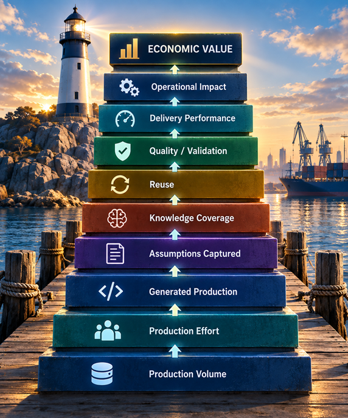
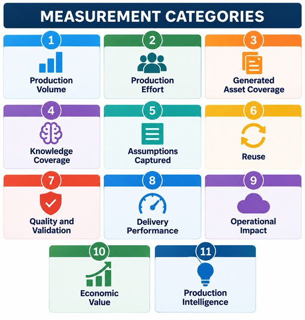
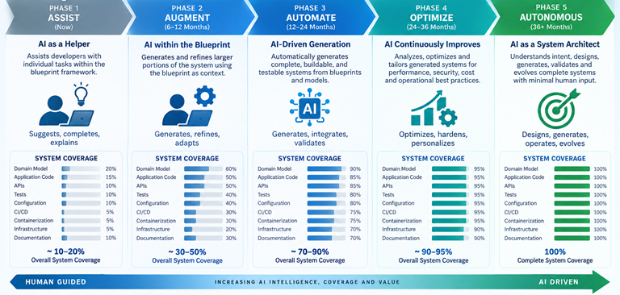
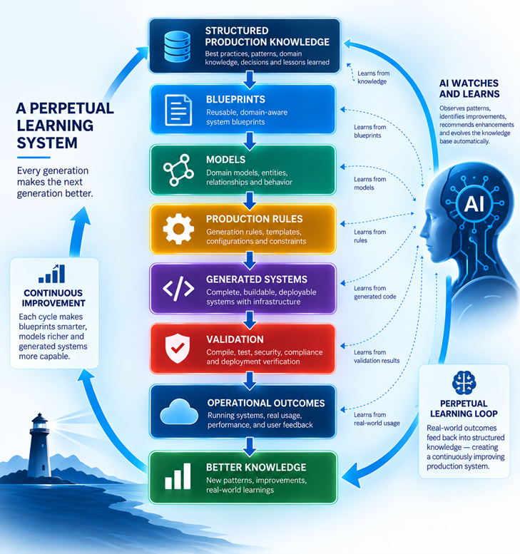
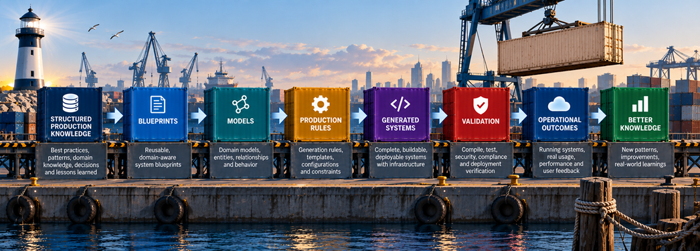

# Measurement Framework

Of all the points of consideration when comparing this platform type to others in the space, a measurement framework is among the greatest differentiators.

A system creation platform has a measurement framework that establishes a hierarchy of evidence for understanding the transformation from human knowledge and assumptions into production-ready systems and, ultimately, operational and economic outcomes.

The objective is not simply to measure how much code is generated. It is to  
- measure how much software-production knowledge has been captured  
- how much production effort it replaces 
- how much of a system it can produce 
- how reliably it produces it 
- how often that knowledge is reused
- what operational and economic outcomes result

Ultimately these measures and results must observable to effectively gauge the overall operation value of  
- the knowledge being captured
- the system being compiled
- the system creation platform itself

Unlike any other system available today, this category makes technical knowledge measurable and visible, offering a 
superior means of communicating of intent and their outcome.  It allows ua to move beyond lines of code generated to understanding
value across the spectrum of software delivery.

---

# The Measurement Stack

The categories form a hierarchy of evidence:



Each level provides evidence for the level above it.

Production volume establishes output.

Production effort establishes the resources required to create that output.

Generated asset coverage establishes how much of the system is produced automatically.

Knowledge coverage and assumptions captured establish how much production knowledge has become explicit and reusable.

Reuse establishes whether that knowledge compounds across systems.

Quality and validation establish whether generated systems are credible.

Delivery performance establishes project-level productivity.

Operational impact establishes what happens after systems are produced and deployed.

Economic value establishes the resulting business impact.

Production intelligence represents the long-term accumulation and increasing usefulness of the entire knowledge base.

---




---

| Category | What It Measures | Importance |
|---|---|---|
| **1. Production Volume** | What is actually produced | Establishes the magnitude of production output |
| **2. Production Effort** | Human effort required to produce the system | Demonstrates productivity improvement and production leverage |
| **3. Generated Asset Coverage** | Code, infrastructure, CI/CD, configuration, tests and other production artifacts generated | Shows how much of the system is produced automatically |
| **4. Knowledge Coverage** | How much system knowledge is represented by blueprints and models | Measures the expanding production capability |
| **5. Assumptions Captured** | Decisions and constraints represented as explicit production knowledge | Measures knowledge that would otherwise depend on individual experts |
| **6. Reuse** | How often existing production knowledge is reused | Demonstrates compounding production capability |
| **7. Quality and Validation** | Whether generated systems compile, test, deploy and operate successfully | Establishes credibility of generated production |
| **8. Delivery Performance** | Time, effort and team size required to deliver systems | Converts production capability into measurable delivery outcomes |
| **9. Operational Impact** | Systems, deployments, workloads and infrastructure resulting from production | Connects software production to cloud and managed-operations economics |
| **10. Economic Value** | Cost, capacity, margin, revenue and consumption effects | Converts technical capability into business value |
| **11. Production Intelligence** | The structured production knowledge available for increasingly intelligent and AI-assisted production | Measures the long-term strategic moat |

---

# 1. Production Volume

## What It Measures

Production volume measures the tangible software and technology artifacts produced by a system creation platform.

The following table represents the production values for the [system generation sessions](../generated-systems/README.md) created for this thesis exercise. 

### Generation Constants
Source - Harbormaster CLI v1.2.0
Deployment - Kubernetes on AWS using Terraform

### Generation Summary
```text
Total Time -            < 4 Hours  
Systems Generated -     94   
Systems Validated -     94  
Systems Containerized - 94  
Total Files -           39,761  
Total LOC -             6,188,132
```

### Blueprint : Spring Boot 3.5
| Domain Model  | Datetime            | Commit SHA                                 | Generation ID | Certification ID                       | Git Repo                                    | Total Files | Total LOCs |
| ------------- | ------------------- | ------------------------------------------ | ------------- | -------------------------------------- | ------------------------------------------- | ----------: | ---------: |
| advertising   | 2026-09-01T18:23:10 | `c72d902d7b20b1f5c3cc3bd43e660eb72adfea39` | GEN-18568715  | `32c9ef22-d5a3-41cf-96cc-61457c570bf8` | Harbormaster-AI/advertising-on-springboot   |         364 |     79,296 |
| aerospace     | 2026-09-01T21:27:47 | `a0f9e9a9e3b5a03b3578230eab5c825b898c3611` | GEN-01259577  | `8f4e62f4-106d-4746-b3ef-909135c0f927` | Harbormaster-AI/aerospace-on-springboot     |         392 |     83,627 |
| analytics     | 2026-09-01T18:42:18 | `302f22986ee4e9ca310fd404efb7a77d9667e0d9` | GEN-33828999  | `b678a37b-c2a7-469f-adb0-0298469978b2` | Harbormaster-AI/analytics-on-springboot     |         385 |     94,051 |
| banking       | 2026-09-01T18:47:15 | `44ceafed7f4512729bcbe1c95e01c08d24e9a6c6` | GEN-09152771  | `40324a6a-3eeb-4a37-989f-7694a200dfd3` | Harbormaster-AI/banking-on-springboot       |         294 |     63,543 |
| crm           | 2026-09-01T19:07:17 | `85aaed5434e09869232be04bb75e5c95b24ba36e` | GEN-44237476  | `50119bf0-92be-41c8-ad40-0b96878d3a5d` | Harbormaster-AI/crm-on-springboot           |         280 |     70,149 |
| ecommerce     | 2026-09-01T22:18:52 | `cd81f46ed09a0e1ce1f1ae035baf657dc435f3ba` | GEN-87233373  | `b3d56b46-0924-4551-b8fe-3cd3f9338d1f` | Harbormaster-AI/ecommerce-on-springboot     |         392 |     90,932 |
| fintech       | 2026-09-01T19:09:38 | `19db9919f98d5e73a5a2cfad2f97a1130c8ea69d` | GEN-81818463  | `0496b587-511e-4fee-974a-456aa69f1fcb` | Harbormaster-AI/fintech-on-springboot       |         469 |    108,762 |
| governance    | 2026-09-01T19:12:44 | `80f87879da01e02e9310ca1d2901174877e02fc0` | GEN-94756143  | `99626594-b5b0-4d76-a03a-f9e43381c1cb` | Harbormaster-AI/governance-on-springboot    |         399 |     95,353 |
| healthcare    | 2026-09-01T20:03:20 | `72e35390dace5858660319260232e69379df4bb1` | GEN-77171795  | `c4339d88-12b5-4625-9227-c552f5728bf6` | Harbormaster-AI/healthcare-on-springboot    |         385 |     87,747 |
| hr            | 2026-09-01T20:05:35 | `1dce7b95f1a77791619ddd24ca8b406eaf945219` | GEN-64048307  | `75c795e2-015b-441a-9e6c-59a0840ec840` | Harbormaster-AI/hr-on-springboot            |         476 |    112,057 |
| insurance     | 2026-09-01T20:35:38 | `e9f010ad582acdc4fcb716065198ded0b75a349a` | GEN-74104582  | `f6e276d4-7b78-4ae0-8962-9d1b0497f763` | Harbormaster-AI/insurance-on-springboot     |         315 |     67,646 |
| inventory     | 2026-09-01T20:47:46 | `483e709cc4230ef263285f1186e67e5fb0d98796` | GEN-93440425  | `566365b9-85d7-40f8-b5ea-315afbcdbba2` | Harbormaster-AI/inventory-on-springboot     |         273 |     59,093 |
| iot           | 2026-09-01T21:01:54 | `4bec2344c1ecddd97935e3ea8c137f16518fbd58` | GEN-25805890  | `a2d8d061-c2cf-4ffd-9b4c-08479062157a` | Harbormaster-AI/iot-on-springboot           |         378 |     84,110 |
| manufacturing | 2026-09-01T21:13:22 | `f20b76ac13f06be701f79facea48f3382ff25b11` | GEN-94563688  | `89c39aef-b6f8-48fb-8d21-412a9f9a1fbf` | Harbormaster-AI/manufacturing-on-springboot |         399 |     89,572 |


### Blueprint : Golang
| Domain Model  | Datetime            | Commit SHA                                 | Generation ID | Certification ID                       | Git Repo                                | Total Files | Total LOCs |
| ------------- | ------------------- | ------------------------------------------ | ------------- | -------------------------------------- | --------------------------------------- | ----------: | ---------: |
| advertising   | 2026-09-07T11:38:46 | `2191c5ea79154e92ae2797297b95dd6e6a8932c6` | GEN-29224206  | `541cd823-3f55-4f95-9dd7-2f33356715f1` | Harbormaster-AI/advertising-on-golang   |         151 |     35,499 |
| aerospace     | 2026-09-07T11:45:11 | `07a3fa8ef1f9dbb4e6dc3139250983bfdd2d4898` | GEN-00568327  | `50b024cb-5371-4dcd-b5e0-19030e70afd2` | Harbormaster-AI/aerospace-on-golang     |         163 |     36,397 |
| analytics     | 2026-09-07T12:15:00 | `cef655346d7e792bb41644e682a179af48e1ba9`  | GEN-99488184  | `fc8eec88-1e86-40f3-bd66-824e03ddac7e` | Harbormaster-AI/analytics-on-golang     |         160 |     48,536 |
| crm           | 2026-09-07T12:22:58 | `c8d72f04438e89ee6c736865f8c758d8939178a6` | GEN-50581662  | `f92681ac-1eab-4f06-bdd3-957185bfb1d6` | Harbormaster-AI/crm-on-golang           |         115 |     38,086 |
| fintech       | 2026-09-07T12:33:03 | `c74d38c44c22f0b80154b34614161a5f8b9edb13` | GEN-37355163  | `dc96afef-ed3f-42d5-a52e-22438d46afdc` | Harbormaster-AI/fintech-on-golang       |         196 |     47,773 |
| governance    | 2026-09-07T12:41:50 | `b09e963caedc446b662e4b923ada36deaf2ffdc2` | GEN-85834532  | `6acb267f-1867-4f37-9b3a-c8a0455c627c` | Harbormaster-AI/governance-on-golang    |         166 |     47,323 |
| healthcare    | 2026-09-07T12:49:32 | `83130b7bf568230de7847ec93ddff502d71f5c0c` | GEN-20175749  | `22215a5f-86fb-4c60-af3b-a7d26ecc56b9` | Harbormaster-AI/healthcare-on-golang    |         160 |     41,377 |
| hr            | 2026-09-07T13:01:26 | `7541c247675d4308e0056111714e853f5101ce0c` | GEN-92153710  | `dfd96a93-7c9f-4d50-9e29-a9cd73f56320` | Harbormaster-AI/hr-on-golang            |         199 |     51,791 |
| insurance     | 2026-09-07T13:09:33 | `cd59b29cef46177914d0adbb5325164955460144` | GEN-98264208  | `34d614a5-0db9-4850-8df7-ac0e6abf8afa` | Harbormaster-AI/insurance-on-golang     |         130 |     30,673 |
| inventory     | 2026-09-07T14:56:08 | `641e982096513a1d6c6440fbb2b7f7eb28a24c15` | GEN-87492851  | `79caa871-f298-436a-86d6-b46b898d903a` | Harbormaster-AI/inventory-on-golang     |         112 |     28,518 |
| iot           | 2026-09-07T15:01:30 | `545ea4ae3a57165664fa431c183eba61640cc6a3` | GEN-62242648  | `17ac5a5a-d135-4ffb-9729-37337902f2fd` | Harbormaster-AI/iot-on-golang           |         157 |     38,527 |
| manufacturing | 2026-09-07T15:06:18 | `1cb29d05e20534034d8bb181c90dd9e326591c38` | GEN-93149624  | `f83987b6-0201-4b8a-98f7-55841588f155` | Harbormaster-AI/manufacturing-on-golang |         166 |     39,814 |


### Blueprint : Angular 22
| Domain Model  | Datetime            | Commit SHA                                 | Generation ID | Certification ID                       | Git Repo                                 | Total Files | Total LOCs |
| ------------- | ------------------- | ------------------------------------------ | ------------- | -------------------------------------- | ---------------------------------------- | ----------: | ---------: |
| advertising   | 2026-09-07T15:58:39 | `9ce6b03950843bcab35fd4d22173244773726f85` | GEN-99146423  | `3c17863e-3a1e-447f-94f1-4e94df51f91d` | Harbormaster-AI/advertising-on-angular   |         618 |     41,732 |
| aerospace     | 2026-09-07T16:03:56 | `26af38ed98624b197346285960744bc66c0a760d` | GEN-23369956  | `56e3824c-a78c-4cb1-b5d9-9b0d25f58689` | Harbormaster-AI/aerospace-on-angular     |         682 |     42,513 |
| analytics     | 2026-09-07T16:09:45 | `f17967804e2d7d872449b4193a95d1cc8d367052` | GEN-29810633  | `7dc69efc-b939-4c0a-95f7-7297586675a1` | Harbormaster-AI/analytics-on-angular     |         666 |     49,849 |
| banking       | 2026-09-07T16:18:15 | `12e34097ff8be472cdefb499a40e9919ab2484ea` | GEN-55250007  | `386b525a-f067-484a-b758-f3c37700d5af` | Harbormaster-AI/banking-on-angular       |         458 |     35,768 |
| crm           | 2026-09-07T16:23:15 | `0ba8aa23d47bdf16a35acec8e4291e1b10138e7a` | GEN-65088882  | `6a314fa8-c47d-4545-b04e-a03a14a037a5` | Harbormaster-AI/crm-on-angular           |         426 |     39,503 |
| fintech       | 2026-09-07T16:28:48 | `8da6f1fb0f780db9157ef05ddcbdaf7a1e8823fd` | GEN-57361653  | `1787a392-fd3f-4710-a6f5-31b24b623f36` | Harbormaster-AI/fintech-on-angular       |         858 |     55,556 |
| governance    | 2026-09-07T16:35:13 | `9637d7998f28b00a216ec94d654bc82321bff2a0` | GEN-15596300  | `7c200671-385f-4f6a-9712-efe8e150d5d9` | Harbormaster-AI/governance-on-angular    |         698 |     51,200 |
| healthcare    | 2026-09-07T16:41:53 | `5f21766d0b8630f6d2fb2b1205a991d715b0f374` | GEN-37901923  | `7675c057-2942-4465-bd76-b34225e84832` | Harbormaster-AI/healthcare-on-angular    |         666 |     45,906 |
| hr            | 2026-09-07T16:48:37 | `b9ea0dadebac36c8be95421bc94779bc96b2bcea` | GEN-91483070  | `da3b6498-426f-4f9b-9405-3aa3d6f9da37` | Harbormaster-AI/hr-on-angular            |         874 |     56,859 |
| insurance     | 2026-09-07T16:56:00 | `0cd0be3afc0083a9b7a221bcdf04c82d04bdf000` | GEN-21517544  | `59dfaf6a-32c9-41e2-ad41-c7549529ce62` | Harbormaster-AI/insurance-on-angular     |         506 |     36,899 |
| inventory     | 2026-09-07T17:03:57 | `88136d956e66f797abfbd483ff360e11bafcb153` | GEN-86139969  | `9e159b1d-e55e-45dd-9a78-cb14a0b8255f` | Harbormaster-AI/inventory-on-angular     |         410 |     33,633 |
| iot           | 2026-09-07T17:10:12 | `de65215864c5a1efa564ef3a7c7dea56e33196d3` | GEN-73222576  | `a1ad4173-49e1-4d5f-b057-a6249e239ff4` | Harbormaster-AI/iot-on-angular           |         650 |     43,608 |
| manufacturing | 2026-09-07T17:16:55 | `0f117d076c1e3f9dbcf23a11b79877cf94efec78` | GEN-39193861  | `5f27c1f6-7cad-4994-b7e5-8843553d84f5` | Harbormaster-AI/manufacturing-on-angular |         698 |     46,490 |

### Blueprint : Django
| Domain Model  | Datetime            | Commit SHA                                 | Generation ID | Certification ID                       | Git Repo                                | Total Files | Total LOCs |
| ------------- | ------------------- | ------------------------------------------ | ------------- | -------------------------------------- | --------------------------------------- | ----------: | ---------: |
| advertising   | 2026-09-08T19:39:58 | `761f607fe906905f07a33721fe6d213dfd3cc676` | GEN-35953547  | `54cb2d0c-2d61-406c-b2e1-825a35f16144` | Harbormaster-AI/advertising-on-django   |         262 |     17,976 |
| aerospace     | 2026-09-08T20:04:08 | `cddf0f96a7176fc6002874ad1ad3c8a392587d21` | GEN-96260352  | `529676bc-89ec-4bd8-843c-ec9b9264e2f5` | Harbormaster-AI/aerospace-on-django     |         273 |     18,095 |
| analytics     | 2026-09-08T20:16:42 | `7fedbee18a418c7a4d9b3247a8fe28d85c0f7250` | GEN-89171801  | `8bb29104-9f39-46fb-a188-897fc2877153` | Harbormaster-AI/analytics-on-django     |         281 |     24,561 |
| crm           | 2026-09-08T20:30:21 | `372a1919be10a8c7a38b6037d461b01ffc694166` | GEN-52390340  | `54282cc5-03a5-42fa-a835-1f5607d037c8` | Harbormaster-AI/crm-on-django           |         201 |     19,379 |
| ecommerce     | 2026-09-08T20:31:35 | `ad82862ddd7fa4ba7ccbf084626cee3186d71c3c` | GEN-17341101  | `3ba147e7-3c58-40c8-89c6-8014c4d01311` | Harbormaster-AI/ecommerce-on-django     |         282 |     21,453 |
| fintech       | 2026-09-09T15:55:13 | `fc814a1a88747eb26b655f5483fbb57e9961349f` | GEN-09021686  | `b5801b70-3ca9-43ad-856b-752edbdaca88` | Harbormaster-AI/fintech-on-django       |         370 |     24,310 |
| governance    | 2026-09-09T15:56:43 | `207a6635355332e581ea3fa1a1067f5cb416f029` | GEN-24214354  | `aab2187f-4b0f-4ee1-af4f-414cd3ffb9f7` | Harbormaster-AI/governance-on-django    |         307 |     24,217 |
| healthcare    | 2026-09-09T16:02:24 | `61c363e7129ea25d2845992309f7d600909c206e` | GEN-21958298  | `a5474f43-4511-4413-bf6f-6f307b1a5a45` | Harbormaster-AI/healthcare-on-django    |         285 |     20,823 |
| hr            | 2026-09-09T16:05:14 | `12f34e85c2bd06e3ba18a9c463f3a5aca000f1ff` | GEN-23530577  | `727d7ec6-59b7-4211-9933-87eac1f60d66` | Harbormaster-AI/hr-on-django            |         359 |     25,804 |
| insurance     | 2026-09-09T16:09:11 | `1302590fbe85e09f7cc42be4ff1a8f80176ec60e` | GEN-31180771  | `0f20a1f8-57b4-43c8-8c0c-eb42d9b59f2e` | Harbormaster-AI/insurance-on-django     |         226 |     15,694 |
| inventory     | 2026-09-09T16:14:51 | `18ddbb153d81a89df561e431c8eb603b3d854abc` | GEN-75665019  | `fb3388c5-4147-41e3-a343-ae595afdb5f8` | Harbormaster-AI/inventory-on-django     |         187 |     14,524 |
| iot           | 2026-09-09T16:17:11 | `4347a76bf0cd9d17de13ea831717e00b236f1d95` | GEN-58277957  | `efff8870-9e9e-4093-a77c-7608a1ca53f3` | Harbormaster-AI/iot-on-django           |         264 |     19,237 |
| manufacturing | 2026-09-08T20:43:14 | `172f2af748cfe9cfc1598a03d832f017f9aa9194` | GEN-44740153  | `047f37a5-a202-4924-a91b-4e127c5f2ba6` | Harbormaster-AI/manufacturing-on-django |         298 |     20,091 |


### Blueprint : Axon Framework/Server 4

| Domain Model  | Datetime            | Commit SHA                                 | Generation ID | Certification ID                       | Git Repo                              | Total Files | Total LOCs |
| ------------- | ------------------- | ------------------------------------------ | ------------- | -------------------------------------- | ------------------------------------- | ----------: | ---------: |
| advertising   | 2026-09-09T14:57:26 | `9fdd1b162312ed3354b7fec91d4d7f948d73d97e` | GEN-73928823  | `c40226d5-cc2b-4355-be9f-65ebd7740a8b` | Harbormaster-AI/advertising-on-axon   |         949 |    218,680 |
| aerospace     | 2026-09-09T15:02:07 | `0305e5f17c18debb5414780dc875eb4c67be1686` | GEN-81255076  | `c9e8f5a3-5915-4c8b-8ef9-b5942d5a783c` | Harbormaster-AI/aerospace-on-axon     |       1,041 |    230,170 |
| analytics     | 2026-09-09T15:04:00 | `ea1347cd17f85bc37ce221003680bb7037623439` | GEN-75867196  | `2eeb4cee-97e9-40d0-a689-05b3e0ec2234` | Harbormaster-AI/analytics-on-axon     |       1,018 |    256,873 |
| banking       | 2026-09-09T15:05:55 | `6b0e9a79d45fcb1beac1d24751357f243141512e` | GEN-49660697  | `9119ee9c-9b9a-4f68-8497-93661d3b6826` | Harbormaster-AI/banking-on-axon       |         719 |    176,092 |
| crm           | 2026-09-09T15:12:37 | `d084702366510ded8d4bc7e1e29a13e4fb699954` | GEN-71432301  | `4d449e44-86be-4603-b7e7-000551f341c8` | Harbormaster-AI/crm-on-axon           |         673 |    191,794 |
| ecommerce     | 2026-09-09T15:14:23 | `34c44d2bca52dad03f499b2888fe06fdd5468555` | GEN-94802115  | `21c3cf72-a5bd-4ca3-9045-999f5388e547` | Harbormaster-AI/ecommerce-on-axon     |       1,041 |    249,413 |
| fintech       | 2026-09-09T15:16:12 | `7ea7f1faf579f67e0bcc9c95f1ab199026a451d3` | GEN-69294877  | `ceef30d7-3406-40f8-ab65-e08c38668c4f` | Harbormaster-AI/fintech-on-axon       |       1,294 |    297,185 |
| governance    | 2026-09-09T15:17:54 | `4b932347c643c866407cb3c85bd3ac6ec532b750` | GEN-37848952  | `e627f71d-1c67-4b49-b484-900d32890fce` | Harbormaster-AI/governance-on-axon    |       1,064 |    262,158 |
| healthcare    | 2026-09-09T15:19:52 | `b1717d96ad7293e002c229f35acc10362f572995` | GEN-05654901  | `7f795079-565b-4643-8727-6e16be2d60dd` | Harbormaster-AI/healthcare-on-axon    |       1,018 |    241,524 |
| hr            | 2026-09-09T15:21:42 | `5630684c56efbedbf20ade37b747dccc4eaba948` | GEN-85831018  | `2aa7109b-6184-4b51-8aa4-7e0f6a26aca6` | Harbormaster-AI/hr-on-axon            |       1,317 |    306,635 |
| insurance     | 2026-09-09T15:25:06 | `17198ee7622bb9a0023704f54512a8f2aad80e1c` | GEN-56631240  | `f6dbf7e6-438b-4e81-aa62-a6154334b36a` | Harbormaster-AI/insurance-on-axon     |         788 |    187,066 |
| inventory     | 2026-09-09T15:27:04 | `660ea7f68312b684ca27276d2720f33b8c851510` | GEN-42839328  | `4fd6040d-4800-4fbf-aa56-ac2022dbf124` | Harbormaster-AI/inventory-on-axon     |         650 |    164,946 |
| iot           | 2026-09-09T15:28:54 | `0302adbefd78d5d4c16af58c1acfb83bdbd3dc10` | GEN-63673989  | `00aaf39d-4bd5-4a54-9066-bf60d0c7eb40` | Harbormaster-AI/iot-on-axon           |         995 |    231,411 |
| manufacturing | 2026-09-09T15:30:53 | `ad3234cce0771455e1c2d78f9cc8d51cd287b20c` | GEN-30716174  | `6a5f407e-7731-4ee2-9be9-892d3729f369` | Harbormaster-AI/manufacturing-on-axon |       1,064 |    245,919 |

### Blueprint : Ruby on Rails

| Domain Model  | Datetime            | Commit SHA                                 | Generation ID | Certification ID                       | Git Repo                               | Total Files | Total LOCs |
| ------------- | ------------------- | ------------------------------------------ | ------------- | -------------------------------------- | -------------------------------------- | ----------: | ---------: |
| advertising   | 2026-09-12T09:23:28 | `060bce048ad9d5a535abc89d44cdd55238910590` | GEN-43962785  | `04aaa4d0-cce7-4258-8aa7-be2ad60554d3` | Harbormaster-AI/advertising-on-rails   |         461 |     10,684 |
| aerospace     | 2026-09-12T09:24:20 | `a9335f20b4139ae55901b8bb674be9b76700b8ce` | GEN-14610808  | `7f9f3b17-b107-42b4-a82b-ef1fcca3b14a` | Harbormaster-AI/aerospace-on-rails     |         505 |     10,875 |
| analytics     | 2026-09-12T09:25:12 | `459e0584a89b57025f74b28d1e8e680770bb3849` | GEN-07055026  | `44d4efa1-2894-4742-bfb6-46c8f9288f43` | Harbormaster-AI/analytics-on-rails     |         494 |     11,416 |
| banking       | 2026-09-12T09:25:57 | `b0699cf55a844bb4164f2b9dd7b0f206eff8d79d` | GEN-48347520  | `9a51fdb0-3b00-4a8a-a788-e9807a1d6056` | Harbormaster-AI/banking-on-rails       |         351 |      9,058 |
| crm           | 2026-09-12T09:26:41 | `20585a7c6bce66551d5d3e703f32b11c7a927cde` | GEN-75201261  | `b22cc429-2682-4e3d-916b-17f5099fc954` | Harbormaster-AI/crm-on-rails           |         329 |      8,954 |
| ecommerce     | 2026-09-12T09:27:34 | `84f789698f016ea2909c0b7bcfd78047fae12276` | GEN-36972941  | `51814746-8d3d-424d-a635-3773f961bc50` | Harbormaster-AI/ecommerce-on-rails     |         505 |     12,211 |
| fintech       | 2026-09-12T09:28:31 | `5ece585f6e9067d9c2e8ba3a492db1d22a28400e` | GEN-67628427  | `24dc8e53-9004-4327-9789-8b17218f8054` | Harbormaster-AI/fintech-on-rails       |         626 |     15,326 |
| governance    | 2026-09-12T09:29:25 | `16caf1e6999c4a480afc07dd1d301a82d4334629` | GEN-98904934  | `938953a8-a433-4dd7-9bf8-777361733d7b` | Harbormaster-AI/governance-on-rails    |         516 |     12,326 |
| healthcare    | 2026-09-12T09:30:19 | `478ca6a4a0396785462e0eb52f996e930a528053` | GEN-18957880  | `1ad90a43-4706-4e5e-a9ba-389fedd82385` | Harbormaster-AI/healthcare-on-rails    |         494 |     11,371 |
| hr            | 2026-09-12T09:31:15 | `c43c28491388cada89d48ef18395c722b8d709cd` | GEN-15649007  | `91308d1d-4af0-40e7-8240-5aaa8e97ddc6` | Harbormaster-AI/hr-on-rails            |         637 |     14,655 |
| insurance     | 2026-09-12T09:32:09 | `d3c7766caad080f294242de2942d7b4e214226b5` | GEN-38564665  | `15a67c0c-2a99-4b80-b4a6-0678dabbdff3` | Harbormaster-AI/insurance-on-rails     |         384 |      9,318 |
| inventory     | 2026-09-12T09:33:00 | `0e2bc81f9ebf97508ae969ba20dca6768ca2e345` | GEN-32273450  | `36be72a6-612c-4805-af89-c5b893d595a7` | Harbormaster-AI/inventory-on-rails     |         318 |      8,062 |
| iot           | 2026-09-12T09:33:54 | `0626be9dfb6bdec0a33e255a84d8c337c8f65a30` | GEN-96288312  | `d58a33e5-5adb-48dd-8db0-d3673d7fddd6` | Harbormaster-AI/iot-on-rails           |         483 |     11,033 |
| manufacturing | 2026-09-12T09:34:41 | `56a9eb6e6ec23f228b7f3af75182b69550c8dd3c` | GEN-00651684  | `d8065da9-4a91-4fe8-9a45-4e64527841ff` | Harbormaster-AI/manufacturing-on-rails |         516 |     12,306 |

### Blueprint : Apollo
| Domain Model  | Files |   LOCs | Generation ID | Certification ID                     | Repository                              |
| ------------- | ----: | -----: | ------------- | ------------------------------------ | --------------------------------------- |
| advertising   |    45 | 16,342 | GEN-13544789  | ecb2a41d-6cec-4539-ab83-cb7339ed7a48 | Harbormaster-AI/advertising-on-apollo   |
| aerospace     |    45 | 16,201 | GEN-95421036  | 99ef90e8-6746-40e2-a876-4d97d3142ddd | Harbormaster-AI/aerospace-on-apollo     |
| analytics     |    45 | 21,054 | GEN-04965157  | 913df446-398b-4484-ad50-b2e4ffa1b439 | Harbormaster-AI/analytics-on-apollo     |
| banking       |    45 | 14,551 | GEN-75456619  | 5dfb1334-44ba-494d-a14a-98873a5f1e22 | Harbormaster-AI/banking-on-apollo       |
| crm           |    45 | 18,247 | GEN-02264190  | 123359a8-5820-4d78-b486-832efdafce68 | Harbormaster-AI/crm-on-apollo           |
| ecommerce     |    45 | 19,299 | GEN-56544182  | 19cb58a2-15b5-4a98-998e-72ab590849ca | Harbormaster-AI/ecommerce-on-apollo     |
| fintech       |    45 | 21,569 | GEN-61720317  | 704e42fe-6ce8-4853-8033-916bd4521226 | Harbormaster-AI/fintech-on-apollo       |
| governance    |    45 | 20,997 | GEN-79449699  | f22cb871-1c8a-4e56-89d9-37a4adf2e683 | Harbormaster-AI/governance-on-apollo    |
| healthcare    |    45 | 18,821 | GEN-09411543  | 88835926-e28f-405e-901f-12985f37962f | Harbormaster-AI/healthcare-on-apollo    |
| hr            |    45 | 22,862 | GEN-33408499  | a4da3dd0-7d75-4ce3-bdb7-5011b4c4c6c5 | Harbormaster-AI/hr-on-apollo            |
| insurance     |    45 | 14,750 | GEN-73783288  | 526532c5-dcf0-474a-abf2-635ae382bc6c | Harbormaster-AI/insurance-on-apollo     |
| inventory     |    45 | 14,266 | GEN-98955510  | 1424b7f5-9174-4a4c-b177-77608e64f2da | Harbormaster-AI/inventory-on-apollo     |
| iot           |    45 | 17,383 | GEN-48866956  | 35a8993f-c571-4cba-a22e-e5cc6cf8af91 | Harbormaster-AI/iot-on-apollo           |
| manufacturing |    45 | 18,397 | GEN-11261412  | b29cf66d-cca9-4a81-ba5f-16d16b3a248c | Harbormaster-AI/manufacturing-on-apollo |

## Production Totals

| Domain Model  | Total Files |    Total LOCs | Total Generation Systems |
| ------------- | ----------: | ------------: | -----------------------: |
| advertising   |       2,850 |       420,209 |                        7 |
| aerospace     |       3,101 |       437,878 |                        7 |
| analytics     |       3,049 |       506,340 |                        7 |
| banking       |       1,867 |       299,012 |                        5 |
| crm           |       2,069 |       386,112 |                        7 |
| ecommerce     |       2,265 |       393,308 |                        5 |
| fintech       |       3,858 |       570,481 |                        7 |
| governance    |       3,195 |       513,574 |                        7 |
| healthcare    |       3,053 |       467,569 |                        7 |
| hr            |       3,907 |       590,663 |                        7 |
| insurance     |       2,394 |       362,046 |                        7 |
| inventory     |       1,995 |       323,042 |                        7 |
| iot           |       2,972 |       445,309 |                        7 |
| manufacturing |       3,186 |       472,589 |                        7 |
| **TOTAL**     |  **39,761** | **6,188,132** |                   **94** |


## Why It Matters

Lines of code and total number of files are not the ultimate measure of value, but they provide a physical measurement of production output.

Production volume establishes:

> **How much software and technology does a system creation platform actually produce?**

When combined with production effort, volume becomes a basis for measuring production leverage.

---

# 2. Production Effort

## What It Measures

Production effort measures the human resources required to produce a system.

Measurements include:

- Developer hours
- Architect hours
- SME hours
- DevOps hours
- QA hours
- Infrastructure engineering hours
- Total person-hours
- Number of people involved
- Calendar time
- Number of sprints

## Why It Matters

Production volume alone does not demonstrate productivity.

The meaningful measurement is the relationship between output and effort.

Using the [system generation outcomes](../generated-systems/README.md) offered for this thesis:

| Metric                             | Conventional Project Assumption |
| ---------------------------------- | ------------------------------: |
| Project duration                   |                        6 months |
| Delivery team                      |                    6 developers |
| Developer effort                   |              1,040 hours/person |
| Total development hours            |                           6,240 |
| Blended billable rate              |                       $110/hour |
| Conventional project value         |                    **$686,400** |
| Harbormaster generation effort     |                           1 day |
| Harbormaster delivery team         |                      1–2 people |
| Estimated HM implementation effort |                        80 hours |
| HM delivery cost/value @ $110/hr   |                      **$8,800** |
| Estimated customer savings         |                    **$677,600** |
| Savings percentage                 |                       **98.7%** |
| Conventional delivery time         |                        6 months |
| HM generation time                 |                          ~1 day |


This establishes **production leverage**.

The objective is to measure how much production output can be created for a defined amount of human effort.

### Applying that to the 94 generated systems

The conventional model represents:

* **94 × 6 months = 564 project-months**
* or approximately **47 project-years** of sequential delivery effort.

### How much software-delivery capacity was created?

If a conventional 6-person team takes six months to deliver one of these systems, then 94 systems represent roughly:

**564 person-months × 6 developers = 3,384 person-months**

or approximately:

#### 282 developer-years of conventional delivery effort

```
Compress hundreds of developer-years of conventional implementation effort into a repeatable generation process.
```
And importantly, this isn't theoretical output: the data contains a **Generation ID and Certification ID for each system**, giving each generated system an auditable identity.

---

# 3. Generated Asset Coverage

## What It Measures

A modern system contains much more than application code.

Seek to measure the percentage of each production artifact generated automatically.

The measure of system coverage is the summation of what can be produced and what was not produced requiring non-system effort. This becomes important to 
determine the trajectory of coverage a blueprint, a domain model, and system compilation are applying overtime.  

The goal is to be constantly moving in a positive, offering more and more contextual data for SMEs and AI to learn from and contribute to.  

Example:

```text
Application code             65%
Database                     85%
REST APIs                    75%
Tests                        75%
Docker                      100%
CI/CD                       100%
Infrastructure               95%
Configuration                90%
Documentation                70%
Security configuration       80%
```

## Why It Matters

This creates a stronger measurement than lines of code:

> **What percentage of the production artifact was actually create?**

This can become a key **Production Coverage** metric.

Production Coverage can be measured across application, infrastructure, deployment, testing, security and operational artifacts.

---

# 4. Knowledge Coverage

## What It Measures

Knowledge coverage measures how much of the knowledge required to produce a system is represented in reusable, executable form.

Knowledge can be measured through:

- Industry domain models
- Technology blueprints
- Solution blueprints
- Infrastructure blueprints
- Production rules
- Configuration
- Policies
- Deployment patterns

For example:

```text
Industry Model
      ↓
Solution Knowledge
      ↓
Technology Blueprint
      ↓
Infrastructure Blueprint
      ↓
Deployment Configuration
      ↓
Generated System
```

## Blueprint Coverage

A useful measurement is the percentage of required production knowledge already represented in reusable blueprints.
This is easiest measured post-production of a system when the level of effort post system creation is known.  The more new blueprints that are authored and the more systems generated, the better opportunity for increasing required system coverage.

The goal is leverage AI throughout the lifecycle of a blueprint.  With enough blueprint history and related context, AI will mature from assisting an SME to becoming a near peer.




## Why It Matters

Knowledge coverage measures the expansion of what system creation platform knows how to produce.

It shifts measurement from:

> **What was produced?**

to:

> **What can be produced?**

---

# 5. Assumptions Captured

## What It Measures

Software projects contain large numbers of architectural, technical and implementation decisions.

Examples include:

- Authentication approach
- Database technology
- Entity relationships
- API conventions
- Error handling
- Logging
- Deployment model
- Security model
- CI/CD process
- Container configuration
- Infrastructure topology
- Retry policies
- Transaction boundaries
- Architectural patterns

Represent these decisions explicitly through models, blueprints, configurations and policies.

## Possible Measurement

A project could measure:

```text
Traditional project
~1,200 implicit production decisions

System-as-Code Outcome
860 encoded decisions
340 remaining human decisions
```

Over time:

```text
Human decisions required

1,200 → 800 → 500 → 250 → 100
```

## Why It Matters

This measures the transition from knowledge existing primarily in people's heads to knowledge existing as explicit, reusable production capability.

The fundamental measurement becomes:

> **How much of software production has become explicit, structured and executable knowledge?**

---

# 6. Reuse

## What It Measures

Reuse measures how frequently previously created production knowledge is applied to subsequent systems.

Possible measurements include:

- Blueprint reuse count
- Domain-model reuse
- Component reuse
- Configuration reuse
- Production-rule reuse
- Cross-customer reuse
- Cross-industry reuse
- Cross-project reuse

Example:

```text
Blueprint A
Used in 1 system

Blueprint B
Used in 7 systems

Blueprint C
Used in 23 systems
```

Since a Blueprint is effectively the capture of knowledge, and knowledge is compoundable, so to are Blueprints.  

Effectively, Blueprint B can be made up of Blueprint A while adding knowledge to enhance Blueprint A while overriding knowledge from Blueprint A.

## Reuse Ratio

A useful aggregate measure is the percentage of production that comes from previously created knowledge.

Example: Single Blueprint

```text
New production knowledge       30%
Previously created knowledge   70%
```

Example: Blueprint Family
```text
# of Derivatives                5
Total Contribution              X%
```

## Why It Matters

Reuse is a primary indicator of compounding capability.

The objective is for the amount of production derived from reusable knowledge to continually increase.

---

# 7. Quality and Validation

## What It Measures

Quality and validation establish whether generated production artifacts actually work.

Possible measurements include:

- Compile success
- Unit test success
- Integration test success
- Runtime validation
- Container validation
- Infrastructure validation
- Deployment success
- Security validation
- API validation
- Database validation
- CI/CD validation
- First-generation production success

Example:

```text
Generated systems              100
Compile successfully            98
Pass automated tests            94
Deploy successfully             92
Runtime validated               90
```

## Why It Matters

Generation alone is insufficient.

Validation establishes whether system production produces credible, deployable and operational systems.

The objective is to establish:

> **How reliably can a working system be produced?**

---

# 8. Delivery Performance

## What It Measures

Delivery performance translates system creation into project-level outcomes.

### Time

Measure:

```text
Requirements → system
Architecture → system
Model → system
System → deployment
```

### Effort

Measure:

```text
Architect hours
Developer hours
DevOps hours
QA hours
```

### Team

Measure:

```text
Architects
Developers
DevOps
QA
```

## Why It Matters

The central delivery measurement is:

> **Time and effort required to produce a system of defined scope.**

This provides the bridge between technical production measurements and business economics.  

Equally important is to establish proof a system creation platform allows the composition of a traditional development to be changed with total team size reduced.  

---

# 9. Operational Impact

## What It Measures

Once more systems are produced, those systems create operational workloads.

The production-to-operations chain can be measured as:

```text
Systems created
       ↓
Applications deployed
       ↓
Workloads created
       ↓
Infrastructure consumed
       ↓
Operations required
```

Possible measurements include:

- Number of deployed systems
- Containers
- VMs
- Kubernetes workloads
- CPUs
- Memory
- Storage
- Network traffic
- Databases
- Cloud resources
- Managed workloads
- Tickets
- Monitoring events
- Operational hours

## Why It Matters

This connects software production to the economics of:

- Cloud providers
- GSI delivery organizations
- Hybrid cloud providers
- Managed service providers

The measurement establishes the relationship between:

> **More efficient software production**

and:

> **More deployed and managed technology.**

---

# 10. Economic Value

## What It Measures

Economic value converts the preceding technical and operational measurements into business outcomes.

Returning to the system generation outcome for this thesis and the project related assumptions applied earlier:


| Domain Model  | Systems |      Files |          LOCs | Conventional Project Value | 
| ------------- | ------: | ---------: | ------------: | -------------------------: | 
| advertising   |       7 |      2,850 |       420,209 |                 $4,804,800 | 
| aerospace     |       7 |      3,101 |       437,878 |                 $4,804,800 | 
| analytics     |       7 |      3,049 |       506,340 |                 $4,804,800 | 
| banking       |       5 |      1,867 |       299,012 |                 $3,432,000 | 
| crm           |       7 |      2,069 |       386,112 |                 $4,804,800 | 
| ecommerce     |       5 |      2,265 |       393,308 |                 $3,432,000 | 
| fintech       |       7 |      3,858 |       570,481 |                 $4,804,800 | 
| governance    |       7 |      3,195 |       513,574 |                 $4,804,800 | 
| healthcare    |       7 |      3,053 |       467,569 |                 $4,804,800 | 
| hr            |       7 |      3,907 |       590,663 |                 $4,804,800 | 
| insurance     |       7 |      2,394 |       362,046 |                 $4,804,800 | 
| inventory     |       7 |      1,995 |       323,042 |                 $4,804,800 | 
| iot           |       7 |      2,972 |       445,309 |                 $4,804,800 | 
| manufacturing |       7 |      3,186 |       472,589 |                 $4,804,800 | 
| **TOTAL**     |  **94** | **39,761** | **6,188,132** |            **$64,531,200** | 

---

# 11. Production Intelligence

## What It Measures

Production intelligence measures the structured body of production knowledge available for system creation and the degree to which that knowledge can support increasingly intelligent production.

Possible measurements include:

```text
Industry domain models
240+

Technology blueprints
X

Solution blueprints
X

Infrastructure patterns
X

Deployment patterns
X

Production rules
X

Validated systems
X

Production decisions
X

Historical outcomes
X
```

The more important measurement is the relationship between these artifacts.

```text
Industry Model
      ↓
Solution Knowledge
      ↓
Technology Blueprint
      ↓
Infrastructure Blueprint
      ↓
Deployment Configuration
      ↓
Validated System
      ↓
Operational Outcome
      ↓
Improved Production Knowledge
```

## Why It Matters

A system creation platform is not simply accumulating files or generated code.

It is accumulating relationships between:

- Production decisions
- Production knowledge
- Generated systems
- Validation results
- Operational outcomes

This creates the foundation for increasingly intelligent software production.

---


# The Production Knowledge Continuum

A second dimension runs through the entire measurement framework:




The resulting measurement objective is therefore not simply:

> **How much code is generated?**

It is:

> **How much software-production knowledge has been captured, how much production effort does it replace, how much of a system can it produce, how reliably can it produce it, how often is that knowledge reused, and what operational and economic outcomes result?**

---

# The Strategic Measurement Model

These measurements ultimately demonstrate a progression:


The purpose of the measurement framework is to make this progression observable and measurable rather than dependent on qualitative claims.

> **A system creation platform can progressively demonstrate the transformation of software-production knowledge into measurable observable production capability, reusable intellectual capital, operational impact and economic value.**
