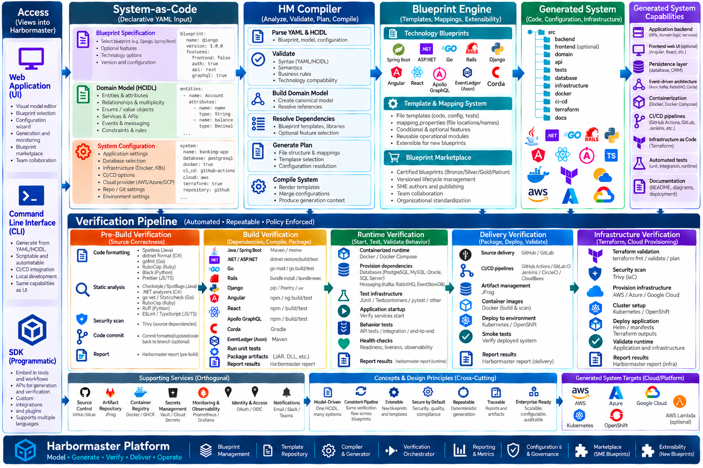

# From Application Generation to System Compilation

Custom applications are an important source of business differentiation and, in many organizations, are critical to day-to-day operations and competitive advantage. Consequently, **how those systems are designed, constructed, delivered, and operated has become an important business consideration—not merely a technical one.**

A **system compiler** addresses this at a fundamentally different level than an application generator.

An application generator primarily automates the production of application artifacts. A system compiler has a much broader purpose: **to transform a declarative expression of intent into a complete, executable system and the associated capabilities required to operate it.** When built and deployed correctly, such a capability can transform an organization's operating model, influencing both technical and non-technical functions and causing large organizations to reconsider how they organize work, allocate expertise, manage risk, deliver technology, and ultimately what is possible.

The foundation for this transformation is a set of **well-defined contracts** that separate intent from implementation. These contracts allow the compiler to remain agnostic to both the components used to construct a system and the models used to describe the desired system. The compiler therefore does not need to be intrinsically bound to a particular programming language, framework, infrastructure technology, or even a particular class of system.

This distinction is fundamental:

> **A software application is a kind of system, but a system is not necessarily a software application.**

Harbormaster currently compiles **application-based systems** because the blueprints developed to date are centered on software languages, frameworks, architectural approaches, infrastructure technologies, and related operational capabilities. These blueprints represent an initial instantiation of a much broader system-compilation model.

Once the underlying contracts and compilation model are established, however, the potential scope extends well beyond today's application-oriented blueprints. A domain model can describe intent that could ultimately be realized as many different kinds of systems, depending on the blueprint, configuration, and capabilities selected for compilation.

The possibilities are therefore not constrained by the applications Harbormaster generates today. **The current blueprints demonstrate the model; they do not define its ultimate boundary.**

This document intentionally focuses on **software systems**. It uses Harbormaster's existing capabilities, system features, and verification evidence to demonstrate how the system-compilation model can produce effects that extend beyond code generation and into architecture, engineering operations, delivery, infrastructure, governance, economics, and organizational capability.

In doing so, the evidence provides a concrete instantiation of—and support for—the broader theses and subtheses presented throughout this document.

---

## Important Concepts
Instrumental to the platform are a set of concepts essential to support an understanding of a platform built to produce ready-to-use software systems. 

## Assumptions
- A platform that creates systems must offer an independent verification and certification process to determine the correctness of the system.
- The inputs and outcomes of the platform will create a large context that AI can mature, moving from assisting on input creation to authoring it.
- Expert-level system generation will prove the best and most reliable way to train AI to eventually generate expert-level systems autonomously.
- The separation of a business requirement and the technology used to support it as a software system is an important archetype.
- When executed correctly, system creation has the opportunity to become a new cycle within the standard SDLC.
- System compiling should be an effortless step in normal software delivery. 

## SMEs
#### Technology experts who have knowledge to be captured and reused for the purpose of creating systems.

## Blueprints
### The means by which SME technical knowledge is captured.

## Domain Models
#### A means by which business knowledge is captured in a standard format.
 
## System-as-Code
#### A declarative way to define the aspects of system to be used by a system compiler

## System Compilation
#### The act of bringing together the declared aspects of system in order to produce a system to be verified and deployed

## System Verification
#### The external steps used to certify a system is well-formed, secure, and deployable.

## Blueprint Certification
#### The external critique of a blueprint for the purpose of scoring its completeness both statistically and dynamically.

## Architecture Metrics
#### A new category of measurements a blueprint centric model driven system enables.

## Big-picture 

**Harbormaster / software industry transformation** perspective  

* change in economics
* change in workload management
* change in revenue per developer
* change in speed of delivery
* change in pricing model
* **change in software development model**
* **change in developer role**
* **change in required skills**
* **change in how expertise is captured and reused**
* **change in software architecture standardization**
* **change in system quality and consistency**
* **change in operational risk**
* **change in security and compliance**
* **change in scalability of engineering organizations**
* **change in how software is maintained and evolved**
* **change in how organizations consume technology expertise**
* **change in the economics of software IP**
* **change in the value of automation**
* **change in the relationship between humans and software generation**
* **change in the boundary between development and operations**
* **change in the software supply chain**
* **change in how software companies differentiate**
* **change in the time-to-value of software investments**

## High-level thesis impact

### 1. Economic

* Economics of software development
* Revenue/value per developer
* Pricing models
* Economics of software IP
* Cost of delivering and maintaining systems

### 2. Workforce

* Developer role
* Required skills
* Workload management
* Scaling engineering expertise
* Human/software collaboration

### 3. Delivery

* Speed of delivery
* Development model
* Automation
* Software supply chain
* Time-to-value

### 4. Enterprise

* Architecture standardization
* Quality and consistency
* Security and compliance
* Operational risk
* Maintainability
* Organizational scalability

### 5. Technology / Business Model

* How expertise is captured and reused
* How organizations consume technology expertise
* How software companies differentiate
* Value of reusable software knowledge/IP
* Boundary between development and operations

A powerful conceptual shift:

> **FOR A GSI:  
> From selling developer time to scaling executable engineering expertise.**  
> 
> **FOR A CLOUD PROVIDER:   
> From selling cloud infrastructure to accelerating the creation of cloud-native workloads.**

- 

