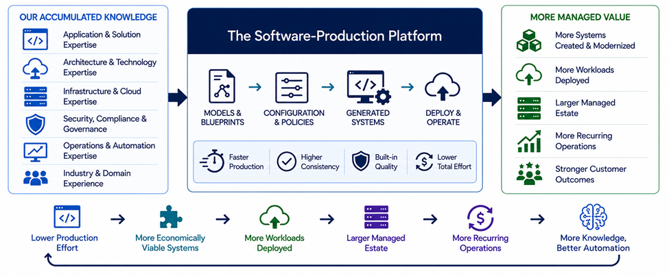

# Why

Create a larger, more valuable managed estate for organizations that manage  large and growing technology environments 

The premise is simple: much of the knowledge required to create, deploy and operate software systems is repeatedly recreated across projects and customers. Capture that knowledge as reusable, executable production capability.

SMEs encode application, architecture, infrastructure, cloud, automation and operational expertise in blueprints; Harbormaster compiles that knowledge into complete systems; and developers can begin innovating from Sprint 1 rather than repeatedly building the foundation from scratch.

For a Managed Hybrid Cloud Provider, the resulting opportunity extends beyond production efficiency.

> **Make more systems economically viable to create and modernize → put more workloads into the managed environment → expand the managed estate → increase recurring operations.**




## The MSP Moat

> **The moatis the reinforcing system created when production power, proprietary production IP, compounding production advantage, and AI production intelligence continuously strengthen one another.**
>
> Explore the moat to understand its hypotheses with evidence to serve as proof to its value as a transformational competitive edge.
>
> [Explore the MSP moat](./moat.md)

---

## The Transformation Creates Four Transcendent Benefits

The four layers are not sequential benefits where one is inherently more valuable than another. They represent four reinforcing ways the transformation can create strategic advantage for a Managed Hybrid Cloud Provider.

---

## 1. Production Power

### Turn Production Knowledge Into Systems

*The Engine That Creates More Workloads*

Application, architecture, infrastructure and operational knowledge becomes executable through blueprints, models and system generation.

Harbormaster allows systems to be created and modernized with progressively less production effort, making projects that previously required substantial engineering resources more economically viable.

For the MSP, this creates the first opportunity:

> **Lower production effort → more systems can be created and modernized.**

The objective is not simply to make existing projects cheaper.

**It is to increase the number of projects that can economically enter the managed environment.**

---

## 2. Managed-Estate Expansion

### Turn More Systems Into More Managed Workloads

*More Systems. More Workloads. Larger Managed Estate.*

Every system created or modernized creates an opportunity for deployment into a private, hybrid or public-cloud environment and, ultimately, for ongoing management.

As Harbormaster reduces the effort required to produce systems, more applications become economically viable to create, modernize and deploy.

That creates a direct connection between software production and managed-services growth:

> **More systems → more workloads → more infrastructure to manage.**

The MSP is no longer limited to competing for a fixed population of existing workloads.

**Harbormaster can help expand the population itself.**

---

## 3. Compounding Operational Advantage

### Make Every Workload Make the Next One Easier

*Every System Adds to the Operational Knowledge Base*

Systems do not simply become additional workloads.

The production and operational experience associated with those systems can become reusable knowledge that improves subsequent implementations.

Blueprints can capture:

- Application architectures.
- Infrastructure configurations.
- Deployment patterns.
- Security and governance requirements.
- Cloud and hybrid-cloud configurations.
- Monitoring and observability patterns.
- Operational procedures.
- Industry-specific requirements.

As this knowledge accumulates, the MSP can increasingly standardize and automate the production and operation of similar systems.

> **More systems → more production knowledge → better blueprints → broader coverage → lower production effort → more systems.**

The result is a potential compounding advantage in both **production and operations**.

---

## 4. Production-to-Operations Intelligence

### Turn Accumulated Knowledge Into an Increasingly Intelligent Managed Environment

*The Moat That Learns From Every System*

The structured body of production and operational knowledge becomes an increasingly valuable substrate for AI.

As the corpus grows, AI can increasingly assist with:

- Selecting appropriate architectures.
- Extending and authoring blueprints.
- Configuring infrastructure.
- Generating deployment environments.
- Applying operational standards.
- Identifying opportunities for modernization.
- Improving system reliability.
- Automating repetitive operational activities.

This creates a progression from **knowledge capture** to **production automation** to increasingly intelligent operation.

> **Production knowledge → executable blueprints → automated production → operational intelligence → increasingly autonomous operations.**

The long-term opportunity is therefore not simply a more efficient MSP.

**It is an MSP whose accumulated production and operational knowledge increasingly becomes executable and AI-operable.**

---

# Four Benefits. One Transformation.

**The MSP decides which matters most.**

- Greater production capacity.
- A larger managed workload estate.
- A compounding production and operational advantage.
- An increasingly intelligent and AI-operable managed environment.

**Harbormaster enables all four.**

---

## How the Four Benefits Reinforce One Another

The four benefits are not independent. They reinforce one another:

```text
                 CENTRAL HYPOTHESIS

     Transform accumulated application, infrastructure
       and operational knowledge into production
                  and operational capability
                         │
        ┌────────────────┼────────────────┐
        │                │                │
        ▼                ▼                ▼
   PRODUCTION       MANAGED-ESTATE    COMPOUNDING
     POWER            EXPANSION        ADVANTAGE
        │                │                │
        └────────────────┼────────────────┘
                         │
                         ▼
                 PRODUCTION-TO-
              OPERATIONS INTELLIGENCE
                         │
                         ▼
                        AI
```
# Explore Operational and Economic Drivers
Discover the full benefits of Harbormaster to a GSI ecosystem.

[Explore Drivers](./drivers.md)

---
