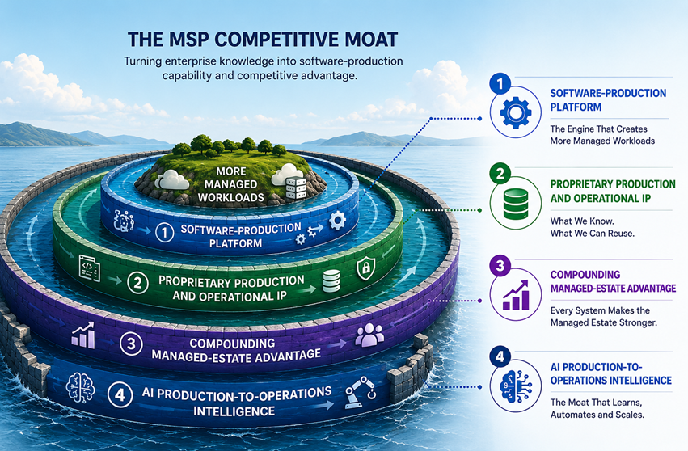

<!--  -->

# From Managed Services Provider to Software-Production and Operations Intelligence Company

A set of hypotheses about how a Managed Hybrid Cloud Provider could transform accumulated application, architecture, infrastructure, cloud and operational knowledge into reusable, executable software-production capability—creating more economically viable systems, more managed workloads, and an increasingly intelligent managed environment. Each hypothesis is intended to be examined against evidence.

## The Four-Layer Moat

1. **Layer 1 — Software-Production Platform** — *The Engine That Creates More Managed Workloads*
2. **Layer 2 — Proprietary Production and Operational IP** — *What We Know. What We Can Reuse.*
3. **Layer 3 — Compounding Managed-Estate Advantage** — *Every System Makes the Managed Estate Stronger*
4. **Layer 4 — AI Production-to-Operations Intelligence** — *The Moat That Learns, Automates and Scales*

---

## Evidence Matrix

| Hypothesis | Layer | Status | Evidence / description |
|---|---:|---|---|
| [H1-01 — Software production can be systematized](./layer-1/h1-01.md) | 1 | Demonstrated | Blueprint, domain model, generated system |
| [H1-02 — Generation can produce production-ready systems](./layer-1/h1-02.md) | 1 | Demonstrated | System-as-Code, Git repository, Docker image |
| [H1-03 — Production can be separated from individual developers](./layer-1/h1-03.md) | 1 | Partial | Blueprints, models and production rules |
| [H1-04 — Lower production effort can make more systems economically viable](./layer-1/h1-04.md) | 1 | Future | Production-effort measurements and project economics |
| [H2-01 — Application and infrastructure expertise can become executable IP](./layer-2/h2-01.md) | 2 | Demonstrated | Blueprint YAML, domain models |
| [H2-02 — Technology expertise can become technology blueprints](./layer-2/h2-02.md) | 2 | Demonstrated | Spring Boot, Axon 4, Corda blueprints |
| [H2-03 — Infrastructure and cloud knowledge can be encoded](./layer-2/h2-03.md) | 2 | Partial | Infrastructure configuration, deployment and system generation |
| [H2-04 — Industry knowledge can become reusable production IP](./layer-2/h2-04.md) | 2 | Demonstrated | Industry domain models, generated systems |
| [H3-01 — Every system can improve the production system](./layer-3/h3-01.md) | 3 | Future | System-to-blueprint refinement examples |
| [H3-02 — Lower production effort can increase the number of economically viable systems](./layer-3/h3-02.md) | 3 | Future | Comparable project economics |
| [H3-03 — More systems can create more managed workloads](./layer-3/h3-03.md) | 3 | Future | Production-to-managed-workload measurements |
| [H3-04 — A Managed Hybrid Cloud Provider can create a blueprint factory](./layer-3/h3-04.md) | 3 | Future | Blueprint lifecycle and certification |
| [H3-05 — A larger managed estate can increase recurring operations](./layer-3/h3-05.md) | 3 | Future | Managed-workload and recurring-revenue measurements |
| [H4-01 — Structured production knowledge makes AI more valuable](./layer-4/h4-01.md) | 4 | Partial | Blueprints, models, generated systems |
| [H4-02 — AI can progress from assisting to authoring](./layer-4/h4-02.md) | 4 | Future | AI progression illustration, blueprint examples |
| [H4-03 — Production and operational knowledge can become AI-ready](./layer-4/h4-03.md) | 4 | Future | Accumulated blueprint, model and operational repository |
| [H4-04 — AI can increasingly connect production with operations](./layer-4/h4-04.md) | 4 | Future | Production-to-operations intelligence and automation |
| [H4-05 — Accumulated knowledge can improve both production and managed operations](./layer-4/h4-05.md) | 4 | Future | Production, workload and operational outcome measurements |

---

## Hypothesis Index

Each hypothesis uses the same outline: **Summary, Implementation, Value — Today, Value — Tomorrow, Evidence, and Vision.**

### Layer 1 · Software-Production Platform

- [H1-01 — Software Production Can Be Systematized](./layer-1/h1-01.md) — Layer 1 · Platform
- [H1-02 — Generation Can Produce Production-Ready Systems](./layer-1/h1-02.md) — Layer 1 · Platform
- [H1-03 — Production Can Be Separated From Individual Developers](./layer-1/h1-03.md) — Layer 1 · Platform
- [H1-04 — Lower Production Effort Can Make More Systems Economically Viable](./layer-1/h1-04.md) — Layer 1 · Platform

### Layer 2 · Proprietary Production and Operational IP

- [H2-01 — Application and Infrastructure Expertise Can Become Executable IP](./layer-2/h2-01.md) — Layer 2 · Production IP
- [H2-02 — Technology Expertise Can Become Technology Blueprints](./layer-2/h2-02.md) — Layer 2 · Production IP
- [H2-03 — Infrastructure and Cloud Knowledge Can Be Encoded](./layer-2/h2-03.md) — Layer 2 · Production IP
- [H2-04 — Industry Knowledge Can Become Reusable Production IP](./layer-2/h2-04.md) — Layer 2 · Production IP

### Layer 3 · Compounding Managed-Estate Advantage

- [H3-01 — Every System Can Improve the Production System](./layer-3/h3-01.md) — Layer 3 · Compounding Advantage
- [H3-02 — Lower Production Effort Can Increase the Number of Economically Viable Systems](./layer-3/h3-02.md) — Layer 3 · Compounding Advantage
- [H3-03 — More Systems Can Create More Managed Workloads](./layer-3/h3-03.md) — Layer 3 · Compounding Advantage
- [H3-04 — A Managed Hybrid Cloud Provider Can Create a Blueprint Factory](./layer-3/h3-04.md) — Layer 3 · Compounding Advantage
- [H3-05 — A Larger Managed Estate Can Increase Recurring Operations](./layer-3/h3-05.md) — Layer 3 · Compounding Advantage

### Layer 4 · AI Production-to-Operations Intelligence

- [H4-01 — Structured Production Knowledge Makes AI More Valuable](./layer-4/h4-01.md) — Layer 4 · AI Intelligence
- [H4-02 — AI Can Progress From Assisting To Authoring](./layer-4/h4-02.md) — Layer 4 · AI Intelligence
- [H4-03 — Production and Operational Knowledge Can Become AI-Ready](./layer-4/h4-03.md) — Layer 4 · AI Intelligence
- [H4-04 — AI Can Increasingly Connect Production With Operations](./layer-4/h4-04.md) — Layer 4 · AI Intelligence
- [H4-05 — Accumulated Knowledge Can Improve Both Production and Managed Operations](./layer-4/h4-05.md) — Layer 4 · AI Intelligence

[<<< return](../README.md)
